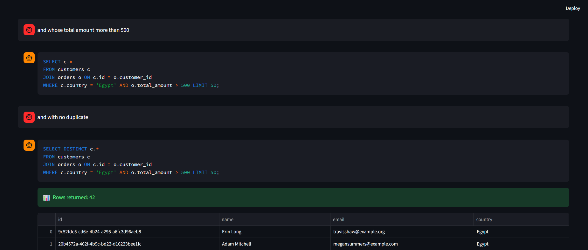

## Text2Sql Chat System
An end-to-end AI-powered **Text-to-SQL system** with multi-turn conversational capabilities.  
The system converts natural language questions into SQL queries, executes them on a PostgreSQL database, and returns results with explanations.

## Demo


## System Architecture


## System Structure 

The project is organized into modular components separating RAG, LLM, API, and frontend layers.
```bash
text2sql/
│
├── app/
│   │
│   ├── core/
│   │   ├── config.py          # Loads environment variables and global settings (paths, API keys)
│   │   └── database.py        # Initializes database engine and session (SQLAlchemy)
│   │
│   ├── db_models/
│   │   ├── categories.py      # Category table model
│   │   ├── customers.py       # Customer table model
│   │   ├── orderitems.py      # Order items (many-to-many relation)
│   │   ├── orders.py          # Orders table model
│   │   ├── products.py        # Products table model
│   │   └── base.py            # Base class for all models (declarative base)
│   │
│   ├── rag/
│   │   ├── embedder.py        # Converts text into vector embeddings
│   │   ├── retriever.py       # Retrieves relevant schema/context using FAISS
│   │   ├── schema_loader.py   # Loads and formats database schema
│   │   ├── example_loader.py  # Loads few-shot NL→SQL examples
│   │   └── vector_store.py    # Manages FAISS index (store + search)
│   │
│   ├── llm/
│   │   ├── generator.py       # Calls Groq LLM to generate SQL queries
│   │   ├── prompt_builder.py  # Builds prompt (schema + context + examples + question)
│   │   └── explainer.py       # Generates natural language explanation of SQL
│   │
│   ├── services/
│   │   ├── text2sql_service.py # Main pipeline: retrieve → generate → execute → explain
│   │   └── sql_executor.py     # Executes SQL queries safely on the database
│   │
│   ├── utils/
│   │   ├── sql_validator.py   # Validates and cleans generated SQL queries
│   │   └── cache.py           # Simple in-memory cache for repeated queries
│   │
│   ├── api/
│   │   ├── __init__.py        # Marks api as a Python package
│   │   ├── main.py            # FastAPI app entry point
│   │   ├── routes.py          # API endpoints (/generate, /chat)
│   │   └── schemas.py         # Request/response models (Pydantic)
│   │
│   ├── frontend/
│   │   └── streamlit_app.py   # Streamlit UI (chat interface + SQL + results)
│   │
│   └── scripts/
│       ├── seed_data.py       # Generates and inserts fake data (Faker)
│       └── create_tables.py   # Creates database tables
│
├── data/
│   │
│   ├── embeddings/
│   │   ├── faiss_index.bin    # FAISS vector index for similarity search
│   │   └── texts.pkl          # Stored text chunks (schema + examples + docs)
│   │
│   └── processed/
│       ├── schema_texts.txt   # Schema as plain text (used in prompts)
│       ├── schema.json        # Structured schema definition
│       └── few_shots.json     # Few-shot NL→SQL examples for prompting
│
├── docker/
│   └── docker-compose.yml     # Docker setup (API + DB)
├── images/
│   ├── API/                   # postman images
│   ├── db/                    # db image for the tables
│   ├── Architecture/          # sys architecture image
│   └── UI/                    # UI images
│
├── requirements.txt           # Python dependencies
├── .env                       # Environment variables (secret keys, DB URL)
├── .env.example               # Example env file for setup
├── .gitignore                 # Ignored files (venv, cache, etc.)
├── LICENSE                    # Project license
└── README.md                  # Project documentation
```

## ⚡ Features

- Retrieval-Augmented Generation (RAG)
- Multi-turn conversational SQL (chat-based queries) & (Conversation Buffer Memory)
- LLM-powered SQL generation (Groq - llama-3.1-8b-instant)
- Executes queries on PostgreSQL database
- Natural language explanation of SQL queries
- Caching for repeated queries
- SQL validation and safe execution
- Interactive UI with Streamlit

## 🤖 Models Used

- **LLM:** llama-3.1-8b-instant (via Groq)
- **Embeddings:** BAAI/bge-large-en-v1.5
- **Vector Store:** FAISS

## ⚙️ Installation

```bash
git clone https://github.com/your-username/text2sql.git
cd text2sql
```
```bash
pip install -r requirements.txt
```
### Start API
```bash
uvicorn app.api.main:app --reload
```

### Start FrontEnd
```bash
streamlit run app/frontend/streamlit_app.py
```
## activate the env
```bash
conda activate text2sql
```

## 📸 Screenshots

### UI


### API (Postman)


## 🚀 Future Improvements

- Add self-correction loop (LLM-based SQL refinement)  
- Improve memory using conversation summarization (long-term memory)  
- Support multiple databases (MySQL, SQLite, etc.)  
- Add user authentication and session-based chat history  
- Enhance SQL validation and error recovery mechanisms  
- Deploy system with Docker + cloud hosting  
- Improve UI/UX with better visualization and query insights  

## 👤 Author

**Ahmed Essam**
- GitHub: [@AhmedEssamSaber](https://github.com/AhmedEssamSaber)

# 📄 License

This project is licensed under the terms in the [LICENSE](<LICENCE>) file.